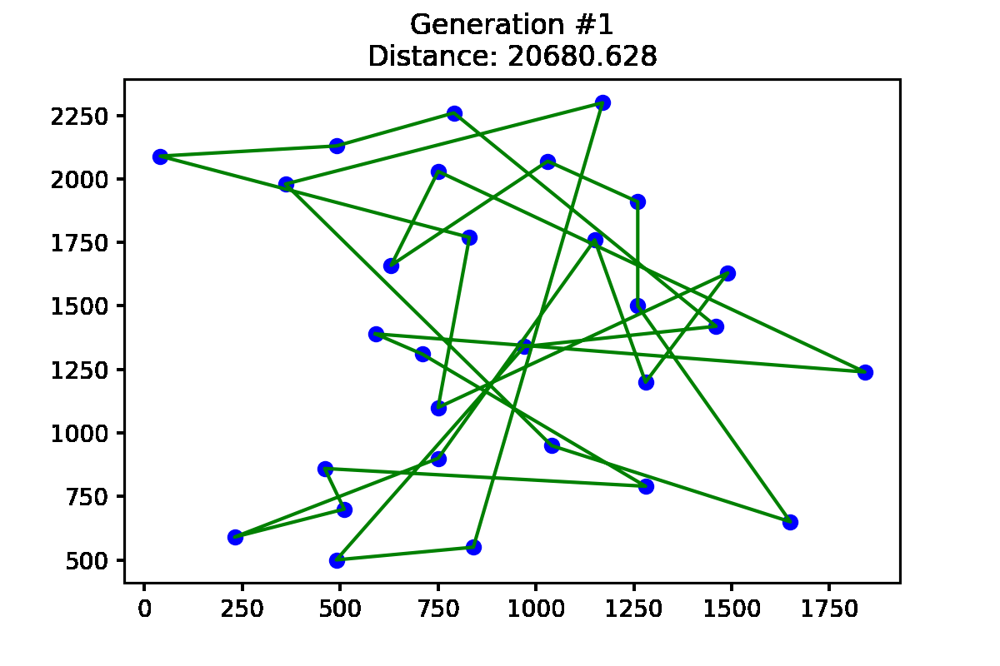
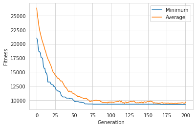

## 🗺 Travelling Salesman Problem (TSP)
The Travelling Salesman Problem (TSP) is a combinatorial optimization problem. 
#### Statement:
*"Given a list of cities and the distances between each pair of the cities, find the shortest possible path that goes through all the cities, and returns to the starting city."*

#### Mathematical Formulation:
If there are $n$ cities ranging from $$\\{ 1,2,3 \dots , n\\}$$ The distance from city $i$ to city $j$ is given by $$c_{i,j} \gt 0 $$ And $x_{i,j}$ is defined as:$$x_{i,j} = {1\ if\ path\ goes\ from\ city\ i\ to\ j\ ,\ 0\ otherwise }$$
Then the Travelling Salesman Problem is defined to minimize the total distance of the path.
$$\sum_{i=1}^{n} \sum_{j\ne i, j=1}^{n} c_{i,j} x_{i,j}$$

This repo tries to solve TSP problem using genetic algorithm implemented using python framework [DEAP](https://deap.readthedocs.io/en/master/).

## ⚙ Usage
```bash
git clone https://github.com/SrjPdl/Travelling-Salesman-GA.git
pip install -r requirements.txt
```
If `pip` doesn't work use `pip3` instead of `pip`.
If there is problem in gif compression, install pygifsicle using
```sudo apt-get install gifsicle```.

## 🛠️ Definition
The problem is taken from [TSBLIB](http://elib.zib.de/pub/mp-testdata/tsp/tsplib/tsp/) library that contains sample problems for the TSP based on actual geographic locations of cities. `bayg29.tsp` is selected and solved in this repo.

## Solution Simulation


## Results

#### 📉Generation vs Fitness


```python
    Best Sequence:
    [24, 18, 10, 21, 16, 13, 17, 14, 3, 9, 19, 1, 28, 2, 25, 8, 4, 20, 5, 11, 27, 0, 23, 12, 15, 26, 7, 22, 6]
    Mimum distance: 9203.3696
```
### 🚀 Author
**Suraj Paudel**

### 📃License
[](https://opensource.org/licenses/MIT)
